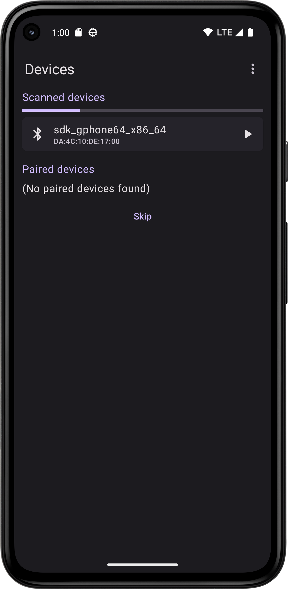
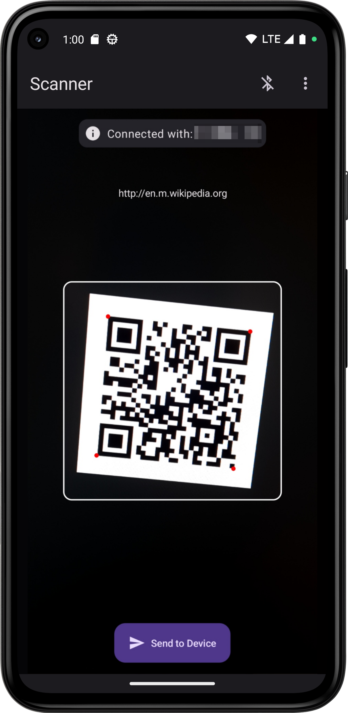
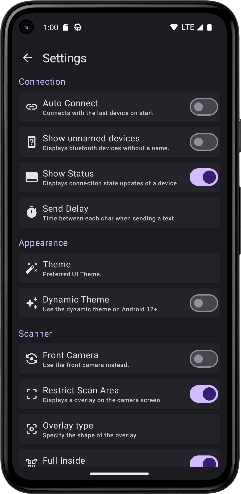
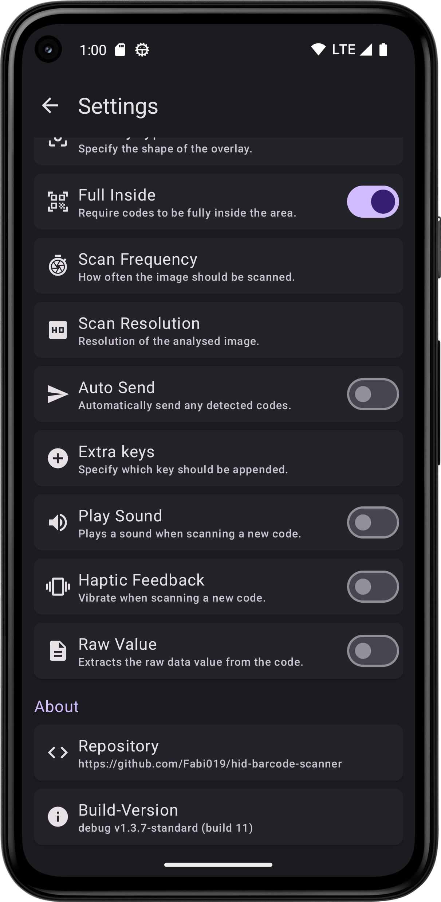

   
   

  

  <h1>QR & Barcode Scanner</h1>

Android app for scanning barcodes with the phone camera and sending them to a PC via bluetooth. No
special software is required on the PC as this app uses the BluetoothHID API available on devices
running Android 9 or greater.

## Features

- Supports a wide range of Linear and 2D-Codes thanks to
  Googles [ML-Kit](https://developers.google.com/ml-kit/vision/barcode-scanning)
- Doesn't require any internet connection
- Large amount of customization for different use-cases
    - Auto connect with last device
    - Auto send on detection
    - Extra keys like \n or \t
    - And much more

## Screenshots

Device list and Scanner screen. If you don't want to connect with any device now and just want to
try out the scanner, pressing the 'Skip'-Button at the bottom of the paired devices will bring you
directly to the scanner.

Otherwise the app tries to connect with the selected device and automatically sends you to the
scanner once connected.

 

All configurable Settings. *(Newer versions might contain more or less settings as shown in the
pictures)*

 

## Download

[//]: # ()

> **Note** 
> Because the version on the Play Store is usually one or two versions behind the latest release,
> you can also download the latest APKs directly here on GitHub as explained in the next section

### Download as APK

Since this app uses the ML-Kit there are two app version to choose from. The *standard* version
doesn't contain the scanner library directly. Because of this the size much smaller than in the
*bundled* but requires the user to have the Play Store installed on their device.

You can either download the latest stable version from
the [Releases](https://github.com/Fabi019/hid-barcode-scanner/releases) tab or directly from
the [CI](https://github.com/Fabi019/hid-barcode-scanner/actions/workflows/test.yml) using the links
below. Please note that the CI version might be unstable and that the builds are not signed (debug
builds), thus requiring you to install them on your phone using *ADB*. The download links below
are using *nightly.link* to provide the files because GitHub doesn't allow to download files from
actions without being logged in.

- Latest APKs (Release): [here](https://github.com/Fabi019/hid-barcode-scanner/releases/latest)
- Latest
  APK (
  Debug): [here](https://nightly.link/Fabi019/hid-barcode-scanner/workflows/test/main/APK%28s%29%20debug%20generated.zip)
- Latest Bundled
  APK (
  Debug): [here](https://nightly.link/Fabi019/hid-barcode-scanner/workflows/test/main/APK%28s%29%20debug%20generated%20%28Bundled%29.zip)

## Troubleshooting

If you are unable to connect with a device you can try either of the steps below depending on how
the app behaves.
If these don't help, feel free to open a new issue and describe your problem in detail.

### Connection dialog visible, but no connection possible

This is most likely caused because the phone was paired with the PC previously and now doesn't
accept a new type of connection request.

***Solution:***

1. Make sure to first unpair the PC on the phone either from within the app or from the system
   Bluetooth settings
2. Remove the phone from the PC device list.
   On Windows you can either do this through the device manager (look under the Bluetooth category)
   and choose *Uninstall Device* or using the device list in the settings app.
3. In the app now search for new devices and click on the target PC (This step could be important so
   that the phone can tell the PC the new device type)
4. A pairing request should show up and you may need to confirm a pin on both sides
5. After that the connection should be successfully established

### Nothing happens when clicking on a device

If there is not even a connection dialog when clicking on a device. This means that the registered
Bluetooth proxy was interrupted. Normally it should be connected again right away but in some cases
this might not happen.

***Solution:***

Restart the app. When launching again, there should be a small message at the bottom of the screen
that says the Bluetooth proxy was successfully connected. Otherwise you may have to restart your
device. This could also mean that your device does not support the Bluetooth HID profile. To test
this, search for the app "Bluetooth HID Profile Tester" in the PlayStore and see what the result is.
If the test is not successful, unfortunately your device is not supported.

*Google Play and the Google Play logo are trademarks of Google LLC.*
